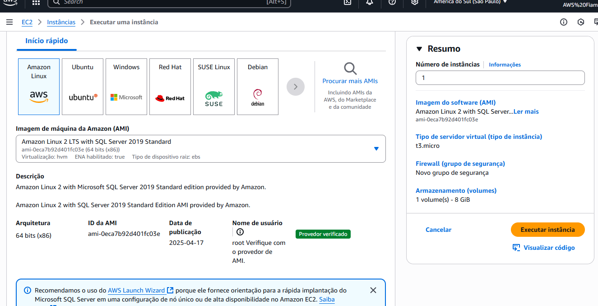
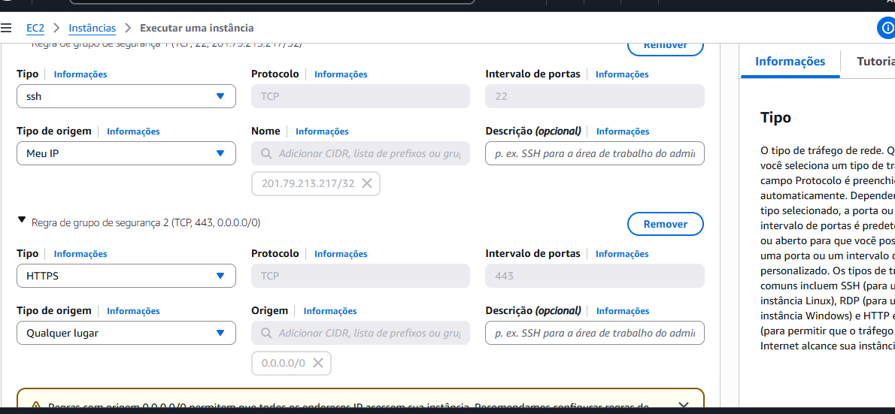
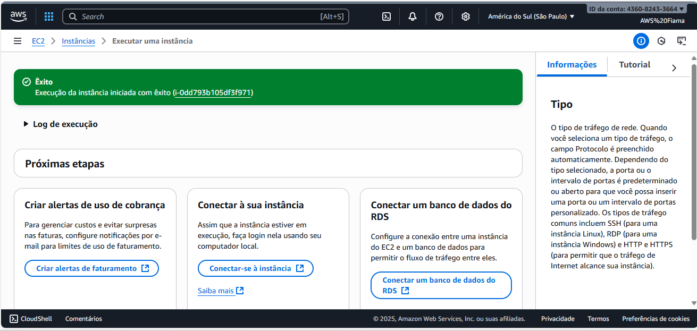

# 🚀 Laboratório AWS EC2 – Fiama Ribeiro

Repositório com minha prática do **Bootcamp DIO**, onde configurei uma instância **Amazon EC2** do zero, instalei o **Apache**, publiquei uma página web personalizada e associei um **Elastic IP**.  

Este projeto faz parte da minha jornada de estudos em **Gestão de TI** e construção de portfólio em **Cloud Computing**.  

---

## 🎯 Objetivos
- Criar e configurar uma instância **Amazon EC2 (Amazon Linux 2023)**
- Utilizar **Key Pair** para acesso seguro via SSH
- Configurar **Security Groups** para liberar portas necessárias
- Instalar e rodar o servidor **Apache**
- Publicar uma **página web personalizada**
- Fixar endereço público com **Elastic IP**
- Documentar o processo no GitHub para uso como portfólio

---

## 🧪 Ambiente
- **Região:** South America (São Paulo) – `sa-east-1`
- **AMI:** Amazon Linux 2023 (ec2-user)
- **Tipo da instância:** t2.micro / t3.micro (Free Tier)
- **Armazenamento:** 8 GiB gp3
- **Security Group:**
  - Inbound: `SSH (22) -> Meu IP`
  - Inbound: `HTTP (80) -> 0.0.0.0/0`
- **Elastic IP:** associado à instância para IP fixo

---

## 🛠️ Passo a Passo

### 1) Criar instância
- AMI: **Amazon Linux 2023**
- Tipo: **t2.micro/t3.micro**
- Key Pair: **fiama-key.pem**
- SG: **SSH (22 Meu IP)** e **HTTP (80 público)**

📸 *Print da seleção da AMI:*  


📸 *Print da criação do Key Pair:*  


📸 *Print do Security Group:*  


---

### 2) Conectar via SSH (Windows / PowerShell)
```powershell
ssh -i "C:\Users\fiama\Downloads\fiama-key.pem" ec2-user@SEU_ELASTIC_IP
```

---

### 3) Instalar e iniciar o Apache
```powershell
sudo dnf -y update
sudo dnf -y install httpd
sudo systemctl start httpd
sudo systemctl enable httpd
sudo systemctl status httpd
```

---

📸 *Apache rodando:*
### 4) Criar página HTML personalizada

Arquivo: /var/www/html/index.html
```powershell
<!DOCTYPE html>
<html lang="pt-br">
<head>
  <meta charset="UTF-8">
  <title>Projeto AWS EC2 - Fiama</title>
  <style>
    body {
      font-family: Arial, sans-serif;
      background: url('avatar.jpg') no-repeat center center fixed;
      background-size: cover;
      color: #fff;
      text-align: center;
      padding: 50px;
    }
    h1 { font-size: 3em; margin-bottom: 20px; text-shadow: 2px 2px 5px rgba(0,0,0,0.7); }
    p  { font-size: 1.3em; margin: 15px 0; text-shadow: 1px 1px 4px rgba(0,0,0,0.6); }
    .footer { margin-top: 50px; font-size: 1em; opacity: 0.9; }
  </style>
</head>
<body>
  <h1>🚀 Site da Fiama na AWS EC2</h1>
  <p>Este é meu laboratório prático do Bootcamp DIO.</p>
  <p>Configurei uma instância <b>Amazon EC2</b> com <b>Apache</b> e publiquei este site diretamente na nuvem ☁️.</p>
  <p>Status: <b>Online e funcionando ✅</b></p>
  <div class="footer">
    <p>📌 Desenvolvido em Setembro/2025 • Portfólio Fiama Ribeiro</p>
  </div>
</body>
</html>
```

---

📸 *Página publicada no navegador:*

### 5) Elastic IP

- EC2 → **Endereços IP elásticos → Alocar**

- **Associar** ao ID da instância

📸 *Print do Elastic IP associado:*

---

### 📸 Evidências (prints principais)

- AMI escolhida

- Key Pair

- Security Group

- Apache rodando

- Página publicada

- Elastic IP associado

### 🔐 Boas práticas

- **Nunca** liberar SSH para ``` 0.0.0.0/0 ``` (use **Meu IP**).

- Sempre **parar a instância** quando não estiver usando (```Stop```) para evitar custos extras.

- Elastic IP só deve ficar associado se realmente for usado (IPs ociosos geram custo).

- Use **tags** para organizar recursos (ex.: ```Projeto=EC2-Lab```, ```Owner=Fiama```).

---

## 📚 Referências
- [Documentação Amazon EC2](https://docs.aws.amazon.com/pt_br/AWSEC2/latest/UserGuide/concepts.html)  
- [Apache HTTPD no Amazon Linux](https://httpd.apache.org/)  
- [Elastic IPs na AWS](https://docs.aws.amazon.com/pt_br/AWSEC2/latest/UserGuide/elastic-ip-addresses-eip.html)  

---

## 👩‍💻 Autora
**Fiama Ribeiro**  
Estudante de Gestão de TI • Bootcamp DIO • Entusiasta de Cloud Computing ☁️  

### 🏷️ Badges do Projeto
  
  
  
  
  
